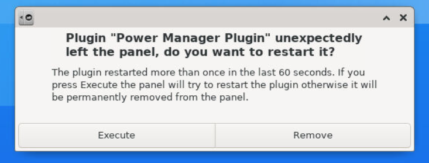

# alpine-xfce-vnc

[![Docker Cloud Build Status][build-image]][build-url]
[![Docker Cloud Automated build][build-automated-image]][build-automated-url]
[![Docker Image Size (tag)][size-image]][size-url]
[![GitHub tag (latest by date)][tag-image]][tag-url]

[build-image]: https://img.shields.io/docker/cloud/build/edgelevel/alpine-xfce-vnc?style=flat-square
[build-url]: https://hub.docker.com/r/edgelevel/alpine-xfce-vnc
[build-automated-image]: https://img.shields.io/docker/cloud/automated/edgelevel/alpine-xfce-vnc?style=flat-square
[build-automated-url]: https://hub.docker.com/r/edgelevel/alpine-xfce-vnc/builds
[size-image]: https://img.shields.io/docker/image-size/edgelevel/alpine-xfce-vnc/latest?color=blueviolet&style=flat-square
[size-url]: https://hub.docker.com/r/edgelevel/alpine-xfce-vnc
[tag-image]: https://img.shields.io/github/v/tag/edgelevel/alpine-xfce-vnc?color=orange&style=flat-square
[tag-url]: https://hub.docker.com/r/edgelevel/alpine-xfce-vnc/tags

[Alpine](https://alpinelinux.org) docker image with [Xfce4](https://xfce.org), [x11vnc](http://www.karlrunge.com/x11vnc) and [noVNC](https://novnc.com/info.html)

```bash
# pull latest image
docker run --rm \
  -p 5900:5900 -p 6080:6080 \
  --name alpine-xfce-vnc \
  --hostname alpine \
  edgelevel/alpine-xfce-vnc
```

Multiple versions are available with the following tags
* `base`, `base-x.y.z`, `x.y.z` and `latest`
* `web`, `web-x.y.z`

---

Connect using [TigerVNC](https://tigervnc.org) client

```bash
# tigervnc-viewer
vncviewer localhost:5900
```

<p align="center">
  
</p>

Connect using [noVNC](https://novnc.com/info.html) via browser

```bash
# (mac|linux) novnc
[open|xdg-open] http://localhost:6080
```

<p align="center">
  
</p>

## Development

```bash
# build images
make docker-build

# run temporary container [base|web]
make docker-run tag=base

# access container
docker exec -it alpine-xfce-vnc bash
supervisorctl status

# cleanup
make docker-clean

# publish a new version on dockerhub
git tag vX.Y.Z
git push origin --tags
```

### Known issues

The first time you access the container, expect the following error

> Plugin "Power Manager Plugin" unexpectedly left the panel, do you want to restart it?

<p align="center">
  
</p>

As explained [here](https://bugzilla.xfce.org/show_bug.cgi?id=15666), *The plugin doesn't work in the container due to a lack of power in docker, so this is not a bug but a limitation of docker*
